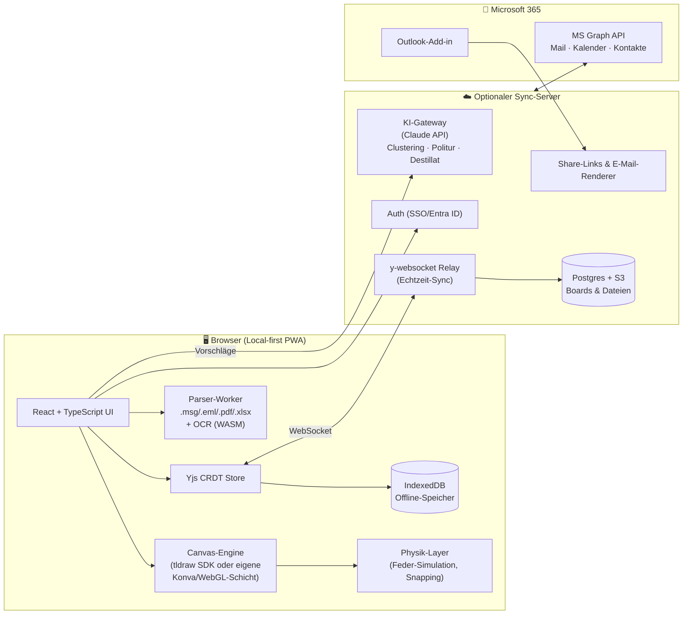
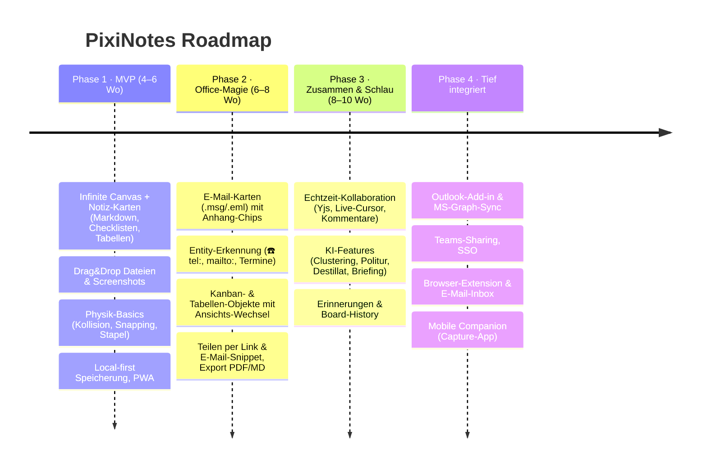

# PixiNotes — Das lebendige Whiteboard für deinen Office-Alltag

> **Ein Satz:** PixiNotes ist ein browserbasiertes, unendliches Whiteboard, auf dem alles, was dir im Arbeitsalltag begegnet — E-Mails, Screenshots, Aufgaben, Tabellen, Ideen — als lebendige, physisch anfassbare Karte landet, sich intelligent selbst organisiert und mit einem Klick teilbar ist.

---

## 1. Vision & Leitprinzipien

PixiNotes vereint die besten Ideen aus fünf Welten und lässt den Rest bewusst weg:

| Herkunft | Was wir übernehmen | Was wir bewusst weglassen |
|---|---|---|
| **Sticky Notes** | Sofort losschreiben, null Struktur-Zwang, Farbe & Haptik | Kein Verlust beim Neustart, keine Zettel-Anarchie |
| **Notion** | Blöcke, Datenbanken, Verknüpfungen, `/`-Befehle | Seitenhierarchie-Labyrinth, Konfigurations-Overhead |
| **OneNote** | Freies Platzieren, Office-Integration, Einfügen von allem | Ribbon-Wust, Sektionen/Notizbuch-Bürokratie |
| **Excalidraw** | Unendliche Leinwand, Zeichnen, Leichtigkeit, lokale Daten | „Nur Zeichnung" — bei uns sind Objekte lebendig |
| **Trello/Kanban** | Karten, Spalten, Fortschritt sichtbar | Board-Silos — Kanban ist bei uns nur *ein* Objekt unter vielen |

### Die vier Leitprinzipien

1. **Zero-Friction Capture** — Jeder Inhalt ist in unter 2 Sekunden auf dem Board: Doppelklick, Paste, Drag & Drop. Keine Dialoge, keine Pflichtfelder, kein „Speichern".
2. **Alles ist eine Karte** — E-Mail, Screenshot, Tabelle, Kanban-Board, Kontakt, Termin: alles ist dasselbe Grundobjekt mit denselben Gesten (verschieben, verbinden, stapeln, teilen).
3. **Das Board denkt mit** — KI und sanfte Physik räumen auf, verknüpfen, erinnern und verbessern — aber immer als Vorschlag, nie als Bevormundung.
4. **Local-first, Cloud-optional** — Alles funktioniert offline im Browser. Sync und Kollaboration kommen dazu, wenn man sie will.

---

## 2. Das Kernkonzept: Der Canvas

### 2.1 Unendliches, zoombares Whiteboard

- **Infinite Canvas** mit sanftem Pan & Zoom (Maus, Trackpad, Touch).
- **Semantic Zoom** — der Zoomlevel bestimmt, was man sieht:
  - *Weit draußen:* Cluster als benannte „Inseln" mit Zusammenfassung („Projekt Atlas — 12 Karten, 3 offene Aufgaben").
  - *Mittel:* Karten mit Titel + Vorschau.
  - *Nah dran:* Voller Inhalt, direkt editierbar.
- **Minimap** unten rechts + `Cmd/Ctrl+K` Spotlight-Suche, die zum Treffer *hinfliegt* statt eine Liste zu zeigen.
- **Boards als Räume:** Man kann mehrere Boards haben („Mein Schreibtisch", „Projekt Atlas", „Team-Board"), aber ein Board reicht lange — dank Clustern und Zoom.

### 2.2 Die Karte (Grundobjekt)

Jede Karte hat:

- **Inhalt** — Markdown-Blöcke (Text, Checkliste, Tabelle, Bild, Code, …)
- **Erscheinung** — Farbe, Größe (frei skalierbar), Stil (Haftnotiz / Karte / Rahmen)
- **Unterelemente** — angeheftete Kinder (Anhänge, Sub-Karten), die als kleine Chips an der Karte hängen und beim Bewegen mitkommen
- **Verbindungen** — elastische Verknüpfungslinien zu anderen Karten (mit optionalem Label: „blockiert", „gehört zu", „siehe auch")
- **Metadaten** — automatisch erkannt: Personen, Termine, Telefonnummern, Links, Fälligkeiten

### 2.3 Spürbare Physik 🧲

Das Board fühlt sich *lebendig* an, ohne zu nerven:

- **Sanfte Kollision:** Karten schieben sich beim Ablegen minimal beiseite statt exakt übereinander zu liegen — nichts geht „verloren", weil es verdeckt wird.
- **Magnetisches Andocken:** Karten in Cluster-Nähe „spüren" eine leichte Anziehung und rasten weich am Raster/an Nachbarkanten ein.
- **Elastische Verbindungen:** Verknüpfungslinien verhalten sich wie weiche Gummibänder — zieht man eine Karte weg, folgt die Linie geschmeidig; verbundene Karten lassen sich als Gruppe „mitziehen".
- **Stapeln:** Karte auf Karte fallen lassen → sie bilden einen ordentlichen Fächer-Stapel (wie echte Haftnotizen), aufklappbar per Klick.
- **Wurf-Geste:** Eine Karte mit Schwung in Richtung eines Clusters „werfen" — sie gleitet hin und ordnet sich ein. (Klingt verspielt, spart aber echt Zeit.)

Alle Physik-Effekte sind subtil (Feder-Animationen ~200 ms), abschaltbar und respektieren `prefers-reduced-motion`.

---

## 3. Objekttypen (alles per Drag & Drop oder `/`-Menü)

### 3.1 📝 Notiz (Haftnotiz)
Doppelklick auf leere Fläche → Notiz erscheint, Cursor blinkt, lostippen. Markdown wird live gerendert (`- ` wird Liste, `# ` wird Titel, `| |` wird Tabelle). `/` öffnet das Block-Menü (Checkliste, Tabelle, Trennlinie, Bild, …).

### 3.2 📧 E-Mail-Karte (das Herzstück für Office!)
**E-Mail aus Outlook aufs Board ziehen** → sie wird sofort eine strukturierte Karte:

```
┌──────────────────────────────────────┐
│ 📧 Angebot Q3 — bitte Freigabe       │
│ Von: Sandra Meier · Do 10:32         │
│ ──────────────────────────────────── │
│ „Hi, anbei das finale Angebot. Kannst│
│ du bis Freitag freigeben? …"         │
│                                      │
│ 📎 Angebot_Q3.pdf   📎 Kalkulation.xlsx │  ← Anhänge als klickbare Chips
│                                      │
│ ✨ Erkannt: ☑ Aufgabe „Freigabe bis Fr" │
│ ↩ Antworten  📅 Termin  ➕ Aufgabe    │
└──────────────────────────────────────┘
```

- **Anhänge werden automatisch Unterelemente** — als Chips an der Karte; ein Anhang lässt sich per Drag *herauslösen* und wird eine eigene Karte (PDF mit Vorschau, Bild als Bild, Excel als Tabellen-Karte).
- **Absender, Betreff, Datum** sauber geparst (`.msg` und `.eml` direkt im Browser).
- **KI extrahiert** Aufgaben, Fristen und Kernaussage („TL;DR in einem Satz").
- **Aktionen direkt auf der Karte:** Antworten (öffnet `mailto:` mit Kontext oder Outlook-Deeplink), Termin daraus machen, Aufgabe daraus machen.

### 3.3 🖼️ Screenshot & Bild
`Ctrl+V` genügt — Screenshot aus der Zwischenablage landet als Bildkarte unter dem Cursor. Optional: KI-OCR macht den Text im Screenshot durchsuchbar und Telefonnummern/Links darin klickbar. Annotieren (Pfeil, Rahmen, Blur für sensible Daten) direkt auf der Karte.

### 3.4 📋 Kanban-Karte
Ein Kanban-Board ist einfach eine *größere Karte* mit Spalten. Die einzelnen Kanban-Tickets sind selbst vollwertige Karten: Man kann ein Ticket **aus dem Kanban herausziehen** aufs Board (z. B. neben die zugehörige E-Mail) — es bleibt mit seiner Spalte verknüpft und zeigt seinen Status als farbigen Rand. Schiebt man es zurück oder ändert den Status auf der Karte, wandert es im Board mit. **Ein Objekt, zwei Ansichten.**

### 3.5 📊 Tabelle / Mini-Datenbank
Tabellen sind mehr als Markdown: Spaltentypen (Text, Zahl, Datum, Person, Auswahl, Fortschritt), Sortierung, Summenzeile. Jede Tabelle kann alternativ **als Kanban oder Kartenliste angezeigt** werden — es ist dieselbe Datenquelle (Notion-Prinzip, aber ohne Setup: Spaltentypen werden aus den Inhalten *erraten*).

### 3.6 📎 Datei-Karte
Beliebige Datei aufs Board ziehen → Karte mit Icon, Name, Größe und Vorschau (PDF-Seite 1, Bild-Thumbnail, Excel-Ausschnitt). Doppelklick öffnet die Vollvorschau im Overlay.

### 3.7 👤 Kontakt-Karte & 📅 Termin-Karte
- Aus einer E-Mail-Signatur oder per Klick auf einen erkannten Namen: **Kontakt-Karte** mit Name, Firma, ☎️ klickbarer Telefonnummer, ✉️ E-Mail. 
- **Termin-Karten** zeigen Countdown („in 3 Tagen") und färben sich, je näher die Frist rückt.

### 3.8 ✏️ Freies Zeichnen & Verbinden (Excalidraw-Gen)
Stift-Werkzeug für schnelle Skizzen, Pfeile, Kreise um Dinge. Skizzen sind ebenfalls Objekte — verschiebbar, löschbar, gruppierbar.

### 3.9 🔗 Link-Karte
URL einfügen → Karte mit Titel, Favicon, Vorschaubild. YouTube/Loom-Links spielen inline ab.

---

## 4. Smart Layer: Automatisch erkannte Inhalte

Über **jedem Text auf dem Board** (Notizen, E-Mails, OCR aus Screenshots) läuft eine Entity-Erkennung:

| Erkannt | Wird zu |
|---|---|
| `+49 170 1234567` | **Klickbar → `tel:`-Link** — ein Klick wählt über Softphone/Teams/Handy. Hover zeigt „Anrufen · Kopieren · Kontakt-Karte erstellen" |
| `sandra@firma.de` | `mailto:`-Link + Kontaktvorschlag |
| „bis Freitag", „am 24.07." | Datums-Chip → ein Klick macht Erinnerung oder Kalendereintrag |
| „TODO", „muss noch", Imperative | Aufgaben-Vorschlag (dezentes ☑-Icon am Rand) |
| Namen von Kollegen | Personen-Chip → verlinkt alle Karten derselben Person |
| Beträge, IBANs, Tracking-Nummern | Kopier-Chip mit einem Klick |

**Wichtig:** Chips sind dezent (leichte Unterstreichung), die Aktion kommt erst bei Hover/Klick. Kein Clippy-Effekt.

---

## 5. KI-Integration („der stille Assistent")

Alle KI-Features folgen einer Regel: **Vorschlagen, nie überschreiben.** Vorschläge erscheinen als sanft pulsierender ✨-Punkt an der Karte; ignorieren kostet nichts.

1. **Auto-Clustering:** „Räum mal auf"-Button (oder automatisch nachts): KI gruppiert Karten thematisch, ordnet sie in benannte Cluster-Inseln und zeigt eine Vorher/Nachher-Vorschau — erst *Übernehmen* macht es wirklich. Einzelne Karten lassen sich vom Aufräumen ausschließen (📌 Pin).
2. **Text-Politur:** Auf jeder Notiz: „Verbessern" → korrigiert Tippfehler, strafft Formulierungen, Diff-Ansicht, ein Klick übernehmen/verwerfen. Auch: „Als professionelle E-Mail formulieren".
3. **E-Mail-Destillat:** Lange Mail-Threads → Kernaussage, offene Fragen, extrahierte Aufgaben mit Frist.
4. **Board-Briefing:** „Was ist heute wichtig?" → KI-Tageszusammenfassung: fällige Aufgaben, unbeantwortete E-Mail-Karten, verwaiste Karten („liegt seit 3 Wochen unangefasst — archivieren?").
5. **Verknüpfungs-Vorschläge:** „Diese E-Mail gehört vermutlich zum Cluster *Projekt Atlas*" — gestrichelte Vorschlagslinie, Klick bestätigt.
6. **Semantische Suche:** „die Mail mit dem Angebot von Sandra" findet die Karte, auch wenn kein Wort exakt stimmt.
7. **Sprachnotiz → Karte:** Diktieren, KI transkribiert und strukturiert (Titel, Stichpunkte, erkannte Aufgaben).

---

## 6. Kollaboration & Teilen (Office-tauglich!)

### 6.1 Multi-User in Echtzeit
- **CRDT-basiert (Yjs):** Konfliktfreies gleichzeitiges Arbeiten, Live-Cursor mit Namen, „Follow me"-Modus (Präsentieren: alle folgen meiner Ansicht).
- **Karten-Klaut-Schutz:** Bearbeitet jemand eine Karte, bekommt sie einen farbigen Rand mit Avatar.
- **Kommentare** als kleine Sprechblasen an Karten, mit @-Erwähnungen.

### 6.2 Teilen nach draußen (der Alltags-Killer-Feature-Block)
- **Share-Link pro Karte, Cluster oder Board** — Empfänger braucht keinen Account (Nur-Lesen) oder kann per Link mitarbeiten. Ablaufdatum & Passwort optional.
- **„Per E-Mail teilen":** Rechtsklick auf Karte/Cluster → PixiNotes rendert den Inhalt als **sauberes HTML-E-Mail-Snippet** (Tabellen als echte Tabellen, Checklisten als ☑/☐) und öffnet den Mail-Entwurf. Kein Screenshot-Gefrickel mehr.
- **Export:** Karte/Cluster/Board als PDF, PNG, Markdown oder Excel (Tabellen). „Board als Statusbericht" → KI baut aus einem Cluster eine ordentliche Management-Summary.
- **Einbetten:** Live-Ansicht eines Boards als iframe (z. B. ins Intranet/SharePoint).

### 6.3 Outlook & Microsoft-Integration (gestaffelt)
- **Stufe 1 (sofort, ohne Admin):** Drag & Drop von `.msg`/`.eml`-Dateien und E-Mails direkt aus dem Outlook-Fenster; `mailto:`-Antworten; `.ics`-Import/-Export für Termine.
- **Stufe 2:** **Outlook-Add-in** „An PixiNotes senden" — Button in Outlook schickt Mail samt Anhängen direkt aufs gewünschte Board.
- **Stufe 3 (MS Graph API):** E-Mail-Karten bleiben live (gelesen/beantwortet-Status), Kalender-Sync für Termin-Karten, Kontakte-Abgleich, „In Teams teilen".

---

## 7. Quality-of-Life — die Liebe zum Detail 💛

- **Papierkorb mit Zeitreise:** Nichts ist je weg. Board-History als Zeitstrahl — „zeig mir das Board von letztem Dienstag".
- **Fokus-Modus:** Eine Karte/Cluster groß in die Mitte, Rest abgedunkelt. Perfekt zum Schreiben oder Präsentieren.
- **Schnellablage („Inbox-Ecke"):** Bildschirmrand-Zone. Alles, was man schnell reinwirft (auch per Browser-Extension oder E-Mail an `board@pixinotes`), sammelt sich dort zum späteren Einsortieren.
- **Vorlagen-Karten:** Meeting-Notiz, Daily, Retro, Entscheidungslog, Pro/Contra — per `/`-Menü, aber auch *eigene* Karten als Vorlage speichern.
- **Karten-Farben mit Bedeutung (optional):** Farb-Legende pro Board („Gelb = Idee, Rot = dringend") — die KI schlägt beim Erstellen die passende Farbe vor.
- **Erinnerungen:** Jede Karte kann klingeln (Browser-Push): „⏰ Karte *Angebot freigeben* — heute fällig".
- **Tastatur-First:** Alles per Tastatur: `N` neue Notiz, `Cmd+K` Suche, Pfeiltasten navigieren zwischen Karten, `Cmd+D` duplizieren, `Space+Drag` pannen.
- **Konfetti, dezent:** Letzten Punkt einer Checkliste abhaken → Mini-Konfetti. Abschaltbar. Aber niemand schaltet es ab. 🎉
- **Dark Mode & Themes:** Automatisch nach System; Boards können Hintergrund-Texturen haben (Kork, Papier, neutral).
- **Barrierefreiheit:** Vollständige Screenreader-Struktur (Karten als Liste navigierbar), Zoom unabhängig vom Browser-Zoom, hohe Kontraste.

---

## 8. Datenmodell: Markdown + Datenbank-Hybrid

**Grundidee:** Inhalte sind Markdown (menschenlesbar, portabel, KI-freundlich), Struktur ist JSON, Sync ist CRDT.

```
Board
 ├─ meta.json            # Titel, Theme, Mitglieder, Farb-Legende
 ├─ canvas.crdt          # Yjs-Dokument: Positionen, Größen, Verbindungen, Z-Order
 ├─ cards/
 │   ├─ 01J5X…K3.md      # Karteninhalt als Markdown + YAML-Frontmatter
 │   └─ …
 ├─ data/
 │   └─ tables/…         # strukturierte Tabellen (Spaltentypen, Zeilen) als JSON
 └─ files/               # Anhänge, Bilder (content-addressed, dedupliziert)
```

Beispiel einer Karte (`cards/01J5X…K3.md`):

```markdown
---
id: 01J5X…K3
type: email
color: sky
created: 2026-07-14T09:12:00Z
source: outlook
entities:
  - {kind: phone, value: "+49 170 1234567"}
  - {kind: due, value: 2026-07-18, label: "Freigabe bis Fr"}
links: [01J5X…M9]        # verbunden mit Aufgaben-Karte
attachments: [sha256-a1b2…, sha256-c3d4…]
---
## Angebot Q3 — bitte Freigabe
**Von:** Sandra Meier · 2026-07-10 10:32

Hi, anbei das finale Angebot…
```

**Warum das clever ist:**
- Jede Karte ist eine **portable Textdatei** → Git-versionierbar, durchsuchbar, exportierbar, kein Lock-in.
- Positionen/Verbindungen leben getrennt im CRDT → flüssige Kollaboration ohne Merge-Konflikte im Inhalt.
- Tabellen als typisiertes JSON → echte Sortierung/Aggregation, trotzdem als Markdown exportierbar.

---

## 8b. Arbeitsordner-Modus: Eine HTML-Datei + deine Ordner 📁

**Ziel:** PixiNotes als **eine einzige HTML-Datei**, die man in einen Arbeitsordner legt. Die App verbindet sich per **File System Access API** (Chrome/Edge, `showDirectoryPicker()`) mit diesem Ordner und legt dort alle Inhalte als Markdown und Dateien ab — versionierbar, durchsuchbar, Backup-fähig, keinerlei Server oder Installation.

**Die 3-Ebenen-Struktur der App wird 1:1 zur Ordnerstruktur:**

```
📁 Mein-Arbeitsordner/
├─ pixinotes.html                  ← die komplette App (Single-File-Build)
├─ workspace.json                  ← Hierarchie & Reihenfolge (Bereiche/Projekte/Boards)
└─ 📁 01 Arbeit/                   ← Ebene 1: Bereich
   └─ 📁 Projekt Atlas/            ← Ebene 2: Projekt
      ├─ 📁 Angebote (Board)/      ← Ebene 3: Board
      │  ├─ board.json             ← Canvas: Positionen, Verbindungen, Kartentypen
      │  ├─ karten/
      │  │  ├─ angebot-q3.md       ← jede Karte = eine Markdown-Datei (mit Frontmatter)
      │  │  └─ aufgaben.md
      │  └─ dateien/               ← Anhänge, Screenshots, E-Mail-Originale (.msg/.eml)
      │     └─ Angebot_Q3.pdf
      └─ 📁 Team-Board/…
```

**Warum das stark ist:**
- **Kein Lock-in:** Notizen sind lesbare `.md`-Dateien — jederzeit mit Obsidian, VS Code oder jedem Editor zu öffnen.
- **Sync gratis:** Der Arbeitsordner kann in OneDrive/Nextcloud/Dropbox liegen → Synchronisation und Backup ohne eigenen Server.
- **Umbenennen/Verschieben in der App = Umbenennen/Verschieben der Ordner** (und umgekehrt beim nächsten Öffnen erkannt).

**Technischer Fahrplan:**
1. Single-File-Build via `vite-plugin-singlefile` (alles inline: JS, CSS, Fonts).
2. Storage-Adapter-Schicht: heute `localStorage`, dann austauschbar gegen `FileSystemDirectoryHandle` (gleiche Store-API, nur anderes Backend) — die jetzige Trennung *Inhalte (boards) vs. Hierarchie (spaces)* ist genau dafür gebaut.
3. Fallback-Kette: File System Access API (Chrome/Edge) → Origin Private File System + Export-Button (Firefox/Safari).

## 9. Architektur & Tech-Stack



**Konkrete Empfehlungen:**

| Baustein | Wahl | Warum |
|---|---|---|
| Canvas | **tldraw SDK** (Start) | Produktionsreifer Infinite Canvas mit Custom Shapes — Karten werden Custom Shapes; spart Monate. Später ggf. eigene Engine. |
| State/Sync | **Yjs + y-indexeddb + y-websocket** | Bewährtes CRDT-Ökosystem, offline-first gratis |
| UI | **React + TypeScript + Vite** | Standard, riesiges Ökosystem |
| E-Mail-Parsing | `.eml`: postal-mime · `.msg`: msg-Parser (WASM) im Web Worker | Läuft komplett im Browser — Datenschutz! |
| Datei-Vorschau | pdf.js, SheetJS (Excel → Tabellen-Karte) | Ebenfalls clientseitig |
| OCR | Tesseract-WASM (lokal) oder KI-Gateway | Wahlfreiheit Datenschutz vs. Qualität |
| KI | **Claude API** über schmales eigenes Gateway | Ein Endpunkt `POST /ai/suggest` mit Task-Typen; Karten bleiben lokal, nur nötiger Text geht raus (Opt-in pro Board) |
| Auth | Entra ID / Google SSO via OIDC | Office-Alltag = Microsoft-Konten |

**Datenschutz-Grundsatz:** Parsing von E-Mails/Dateien passiert **im Browser**. KI-Features sind pro Board opt-in und senden nur den minimal nötigen Textauszug.

---

## 10. UX: Selbsterklärend ab Sekunde 1

- **Leeres Board = sanfte Einladung:** Drei Geister-Karten liegen auf dem ersten Board: „👋 Doppelklick irgendwo = neue Notiz", „📧 Zieh eine E-Mail hierher", „🖼️ Ctrl+V fügt Screenshots ein". Sie verschwinden, sobald man die Aktion einmal gemacht hat.
- **Ein Werkzeug-Dock, fünf Icons:** Auswählen · Notiz · Stift · Verbinden · Suche. Alles Weitere über `/` in Karten und Rechtsklick. Keine Menüband-Hölle.
- **Progressive Disclosure:** Tabellen-Spaltentypen, Farb-Legenden, Automationen tauchen erst auf, wenn man sie das erste Mal braucht.
- **Undo überall:** `Cmd+Z` gilt für *alles*, auch fürs KI-Aufräumen. Der Undo-Toast sagt immer, was passiert ist („12 Karten gruppiert — Rückgängig?").

---

## 11. Roadmap (MVP → Wow)



**MVP-Definition of Done:** Ein neuer User legt ohne Anleitung in < 60 Sekunden drei Notizen an, zieht einen Screenshot rein, verbindet zwei Karten und findet alles nach Browser-Neustart wieder.

---

## 12. Offene Entscheidungen

1. **tldraw SDK vs. eigene Canvas-Engine** — tldraw beschleunigt enorm, Lizenz (Watermark/kommerziell) prüfen; Alternative: Konva/PixiJS-Eigenbau (mehr Kontrolle über Physik, mehr Aufwand).
2. **Hosting-Modell** — reine PWA + „Bring your own Sync" (z. B. Firmen-Server) vs. gehostetes SaaS.
3. **Outlook-Drag&Drop-Tiefe** — Direktes Ziehen aus dem Outlook-Client liefert je nach Plattform `.msg`-Dateien (Windows-Client) oder nur Text (Web) → Add-in als zuverlässiger zweiter Weg früh einplanen.
4. **KI-Anbieter & Datenresidenz** — Claude API via EU-Region / eigenes Gateway; Feature-Flags pro Board.

---

*Dieses Konzept ist der Startpunkt. Der interaktive Prototyp unter [`prototype/index.html`](../prototype/index.html) macht das Board-Gefühl — Physik, Karten, E-Mail-Objekte, Kanban — direkt im Browser erlebbar.*
